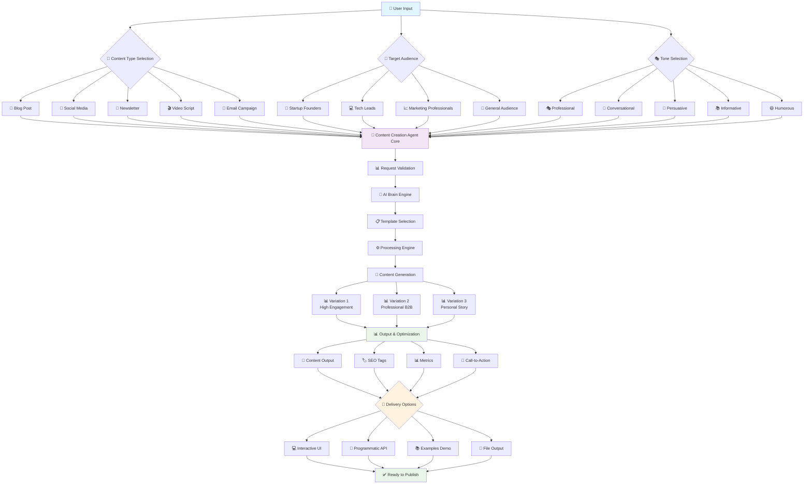
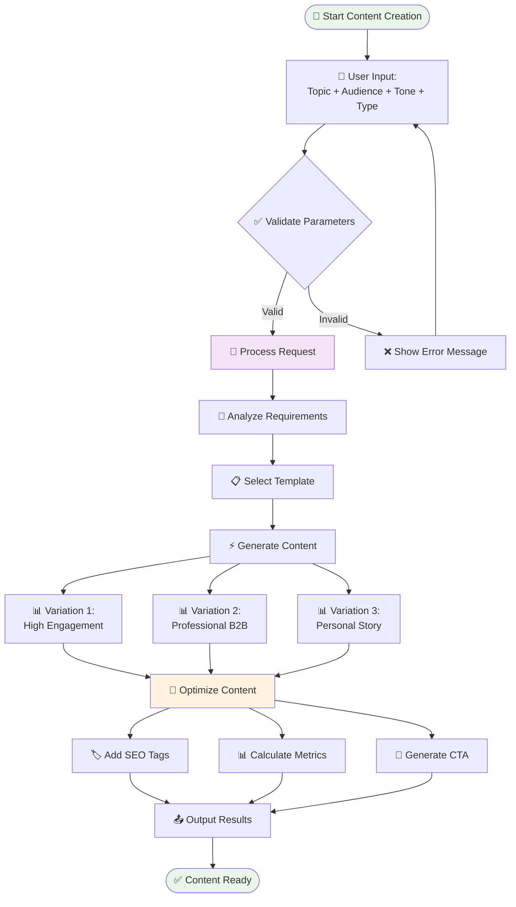
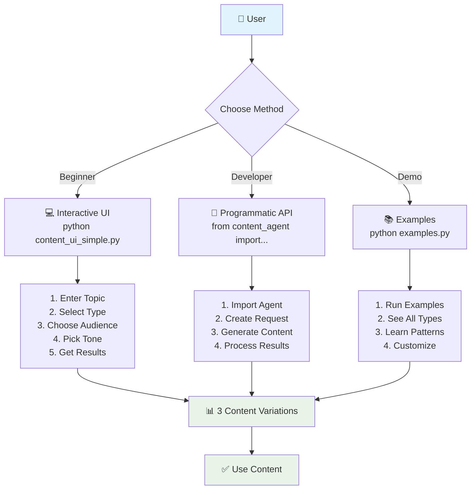
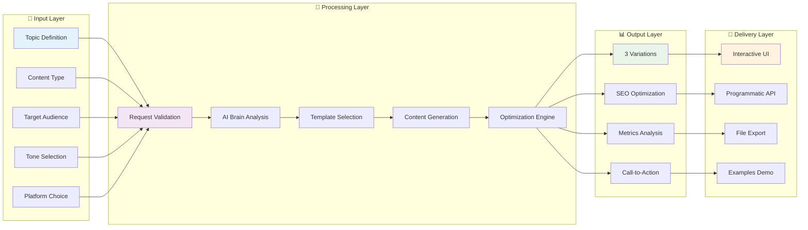

# 🚀 Content Creation Agent - Complete Guide

A powerful, versatile AI-powered content generation system that creates high-quality, engaging content across multiple formats including blogs, social media posts, newsletters, video scripts, and email campaigns.

## 📋 Table of Contents

- [🎯 Project Flow Diagram](#-project-flow-diagram)
- [✨ Features](#-features)
- [🎯 Supported Content Types](#-supported-content-types)
- [🚀 Installation & Setup](#-installation--setup)
- [📖 Quick Start Guide](#-quick-start-guide)
- [🎯 Detailed Usage Examples](#-detailed-usage-examples)
- [⚙️ Configuration Options](#️-configuration-options)
- [🔧 Advanced Features](#-advanced-features)
- [📊 Output Formats](#-output-formats)
- [🛠️ Troubleshooting](#️-troubleshooting)
- [❓ Frequently Asked Questions](#-frequently-asked-questions)
- [📁 File Structure](#-file-structure)
- [🤝 Contributing](#-contributing)
- [📄 License](#-license)

## 🎯 Project Flow Diagram

### 🚀 **Complete Content Creation Agent Workflow**

```
┌─────────────────────────────────────────────────────────────────────────────────────────────────┐
│                                    🎯 CONTENT CREATION AGENT                                    │
│                                        Complete Workflow                                        │
└─────────────────────────────────────────────────────────────────────────────────────────────────┘

┌─────────────────┐    ┌─────────────────┐    ┌─────────────────┐    ┌─────────────────┐
│   📝 USER       │    │   🎯 TOPIC      │    │   👥 AUDIENCE   │    │   🎭 TONE       │
│   INPUT         │    │   DEFINITION    │    │   SELECTION     │    │   CHOICE        │
└─────────────────┘    └─────────────────┘    └─────────────────┘    └─────────────────┘
         │                       │                       │                       │
         └───────────────────────┼───────────────────────┼───────────────────────┘
                                 │                       │                       │
                                 ▼                       ▼                       ▼
┌─────────────────────────────────────────────────────────────────────────────────────────────────┐
│                              🤖 CONTENT CREATION AGENT CORE                                     │
│                                                                                                 │
│  ┌─────────────────┐  ┌─────────────────┐  ┌─────────────────┐  ┌─────────────────┐            │
│  │   📊 REQUEST    │  │   🧠 AI BRAIN   │  │   📋 TEMPLATE   │  │   ⚙️ PROCESSING  │            │
│  │   VALIDATION    │  │   ENGINE        │  │   SELECTION     │  │   ENGINE        │            │
│  └─────────────────┘  └─────────────────┘  └─────────────────┘  └─────────────────┘            │
│           │                     │                     │                     │                    │
│           ▼                     ▼                     ▼                     ▼                    │
│  ┌─────────────────┐  ┌─────────────────┐  ┌─────────────────┐  ┌─────────────────┐            │
│  │ ✅ Validates    │  │ 🎯 Analyzes     │  │ 📝 Chooses      │  │ ⚡ Generates     │            │
│  │    Parameters   │  │    Audience     │  │    Template     │  │    3 Variations │            │
│  │ ✅ Checks       │  │ 🎭 Adapts       │  │ 📊 Applies      │  │ 🔄 Optimizes    │            │
│  │    Requirements │  │    Tone         │  │    Structure    │  │    Content      │            │
│  └─────────────────┘  └─────────────────┘  └─────────────────┘  └─────────────────┘            │
└─────────────────────────────────────────────────────────────────────────────────────────────────┘
                                 │
                                 ▼
┌─────────────────────────────────────────────────────────────────────────────────────────────────┐
│                              📊 CONTENT TYPE PROCESSING                                         │
│                                                                                                 │
│  ┌─────────────────┐  ┌─────────────────┐  ┌─────────────────┐  ┌─────────────────┐            │
│  │   📝 BLOG       │  │   📱 SOCIAL      │  │   📧 NEWSLETTER │  │   🎬 VIDEO      │            │
│  │   POSTS         │  │   MEDIA          │  │                 │  │   SCRIPTS       │            │
│  │                 │  │                 │  │                 │  │                 │            │
│  │ • 500-800 words │  │ • Platform      │  │ • 600 words     │  │ • 1200 words    │            │
│  │ • SEO Optimized │  │   Specific      │  │ • Structured    │  │ • Timestamped    │            │
│  │ • Subheadings   │  │ • Hashtags      │  │ • Sections      │  │ • Production     │            │
│  │ • CTAs          │  │ • Engagement    │  │ • CTAs          │  │   Notes          │            │
│  └─────────────────┘  └─────────────────┘  └─────────────────┘  └─────────────────┘            │
│                                                                                                 │
│  ┌─────────────────┐                                                                           │
│  │   📩 EMAIL      │                                                                           │
│  │   CAMPAIGNS     │                                                                           │
│  │                 │                                                                           │
│  │ • 400 words     │                                                                           │
│  │ • Subject Lines │                                                                           │
│  │ • Personal CTAs │                                                                           │
│  │ • Sequences     │                                                                           │
│  └─────────────────┘                                                                           │
└─────────────────────────────────────────────────────────────────────────────────────────────────┘
                                 │
                                 ▼
┌─────────────────────────────────────────────────────────────────────────────────────────────────┐
│                              🎯 AUDIENCE & TONE ADAPTATION                                      │
│                                                                                                 │
│  ┌─────────────────┐  ┌─────────────────┐  ┌─────────────────┐  ┌─────────────────┐            │
│  │ 🚀 STARTUP      │  │ 💻 TECH LEADS   │  │ 📈 MARKETING    │  │ 👥 GENERAL      │            │
│  │ FOUNDERS        │  │                 │  │ PROFESSIONALS  │  │ AUDIENCE        │            │
│  │                 │  │                 │  │                 │  │                 │            │
│  │ • Growth Focus  │  │ • Technical     │  │ • ROI Focus     │  │ • Accessible    │            │
│  │ • Funding       │  │   Depth         │  │ • Campaigns     │  │ • Clear         │            │
│  │ • Innovation    │  │ • Best Practices│  │ • Metrics       │  │ • Benefits      │            │
│  │ • Business      │  │ • Architecture  │  │ • Strategy      │  │ • Simple        │            │
│  └─────────────────┘  └─────────────────┘  └─────────────────┘  └─────────────────┘            │
│                                                                                                 │
│  ┌─────────────────┐  ┌─────────────────┐  ┌─────────────────┐  ┌─────────────────┐            │
│  │ 🎭 PROFESSIONAL │  │ 💬 CONVERSATIONAL│  │ 🎯 PERSUASIVE   │  │ 📚 INFORMATIVE  │            │
│  │                 │  │                 │  │                 │  │                 │            │
│  │ • Authoritative │  │ • Friendly      │  │ • Compelling    │  │ • Educational   │            │
│  │ • Data-Driven   │  │ • Personal      │  │ • Emotional     │  │ • Structured    │            │
│  │ • Credible      │  │ • Accessible    │  │ • Logical       │  │ • Clear         │            │
│  │ • Industry      │  │ • Anecdotes     │  │ • Urgent        │  │ • Explanatory   │            │
│  └─────────────────┘  └─────────────────┘  └─────────────────┘  └─────────────────┘            │
│                                                                                                 │
│  ┌─────────────────┐                                                                           │
│  │ 😄 HUMOROUS     │                                                                           │
│  │                 │                                                                           │
│  │ • Witty         │                                                                           │
│  │ • Light-hearted │                                                                           │
│  │ • Engaging      │                                                                           │
│  │ • Appropriate   │                                                                           │
│  └─────────────────┘                                                                           │
└─────────────────────────────────────────────────────────────────────────────────────────────────┘
                                 │
                                 ▼
┌─────────────────────────────────────────────────────────────────────────────────────────────────┐
│                              🔄 CONTENT GENERATION ENGINE                                       │
│                                                                                                 │
│  ┌─────────────────┐  ┌─────────────────┐  ┌─────────────────┐  ┌─────────────────┐            │
│  │ 📊 VARIATION 1  │  │ 📊 VARIATION 2  │  │ 📊 VARIATION 3  │  │ 📊 ANALYSIS     │            │
│  │                 │  │                 │  │                 │  │                 │            │
│  │ 🎯 High         │  │ 🎯 Professional │  │ 🎯 Personal      │  │ 📈 Performance  │            │
│  │    Engagement   │  │    B2B Focus   │  │    Story-Driven  │  │    Metrics       │            │
│  │ 🚀 Viral        │  │ 💼 Corporate    │  │ 📖 Narrative    │  │ 🎯 Audience      │            │
│  │    Potential    │  │    Ready        │  │    Style        │  │    Insights      │            │
│  │ 📱 Social       │  │ 📊 Data-Heavy   │  │ 💭 Emotional    │  │ 💡 Optimization │            │
│  │    Media        │  │    Content      │  │    Connection   │  │    Tips          │            │
│  └─────────────────┘  └─────────────────┘  └─────────────────┘  └─────────────────┘            │
└─────────────────────────────────────────────────────────────────────────────────────────────────┘
                                 │
                                 ▼
┌─────────────────────────────────────────────────────────────────────────────────────────────────┐
│                              📊 OUTPUT & OPTIMIZATION                                            │
│                                                                                                 │
│  ┌─────────────────┐  ┌─────────────────┐  ┌─────────────────┐  ┌─────────────────┐            │
│  │ 📝 CONTENT      │  │ 🏷️ SEO TAGS     │  │ 📊 METRICS      │  │ 🎯 CALL-TO-      │            │
│  │ OUTPUT          │  │                 │  │                 │  │ ACTION          │            │
│  │                 │  │                 │  │                 │  │                 │            │
│  │ • Title         │  │ • Keywords      │  │ • Word Count    │  │ • Compelling    │            │
│  │ • Content       │  │ • Hashtags      │  │ • Readability   │  │   Phrases       │            │
│  │ • Headings      │  │ • Meta Tags     │  │ • Score         │  │ • Platform      │            │
│  │ • Structure     │  │ • Optimization  │  │ • Analysis      │  │   Specific      │            │
│  └─────────────────┘  └─────────────────┘  └─────────────────┘  └─────────────────┘            │
└─────────────────────────────────────────────────────────────────────────────────────────────────┘
                                 │
                                 ▼
┌─────────────────────────────────────────────────────────────────────────────────────────────────┐
│                              🚀 DELIVERY & USAGE OPTIONS                                        │
│                                                                                                 │
│  ┌─────────────────┐  ┌─────────────────┐  ┌─────────────────┐  ┌─────────────────┐            │
│  │ 💻 INTERACTIVE  │  │ 🐍 PROGRAMMATIC│  │ 📚 EXAMPLES     │  │ 📁 FILE OUTPUT  │            │
│  │ UI              │  │ API             │  │ DEMO            │  │                 │            │
│  │                 │  │                 │  │                 │  │                 │            │
│  │ • Guided        │  │ • Python        │  │ • 5 Complete    │  │ • Markdown      │            │
│  │   Interface     │  │   Integration   │  │   Examples      │  │   Files         │            │
│  │ • Step-by-Step  │  │ • Batch         │  │ • All Content   │  │ • Text Files    │            │
│  │   Process       │  │   Processing    │  │   Types         │  │ • JSON Export   │            │
│  │ • User-Friendly │  │ • Customization │  │ • Best          │  │ • Ready to      │            │
│  │   Prompts       │  │ • Automation    │  │   Practices     │  │   Publish       │            │
│  └─────────────────┘  └─────────────────┘  └─────────────────┘  └─────────────────┘            │
└─────────────────────────────────────────────────────────────────────────────────────────────────┘

┌─────────────────────────────────────────────────────────────────────────────────────────────────┐
│                              🎯 USAGE WORKFLOW EXAMPLES                                         │
└─────────────────────────────────────────────────────────────────────────────────────────────────┘

┌─────────────────┐    ┌─────────────────┐    ┌─────────────────┐    ┌─────────────────┐
│   🚀 QUICK      │    │   📝 BLOG       │    │   📱 SOCIAL     │    │   📧 EMAIL      │
│   START         │    │   CREATION      │    │   CAMPAIGN      │    │   SEQUENCE      │
└─────────────────┘    └─────────────────┘    └─────────────────┘    └─────────────────┘
         │                       │                       │                       │
         ▼                       ▼                       ▼                       ▼
┌─────────────────┐    ┌─────────────────┐    ┌─────────────────┐    ┌─────────────────┐
│ 1. Run UI       │    │ 1. Define Topic │    │ 1. Choose       │    │ 1. Welcome      │
│ 2. Enter Topic  │    │ 2. Select       │    │    Platforms    │    │    Email        │
│ 3. Choose Type  │    │    Audience     │    │ 2. Generate     │    │ 2. Educational  │
│ 4. Get Results  │    │ 3. Pick Tone    │    │    Variations   │    │    Content      │
│ 5. Copy & Use   │    │ 4. Generate     │    │ 3. Schedule     │    │ 3. Promotional  │
│                 │    │    Content      │    │    Posts        │    │    Campaign     │
│                 │    │ 5. Publish      │    │ 4. Track        │    │ 4. Automate     │
│                 │    │                 │    │    Results      │    │    Sequence     │
└─────────────────┘    └─────────────────┘    └─────────────────┘    └─────────────────┘

┌─────────────────────────────────────────────────────────────────────────────────────────────────┐
│                              🎉 SUCCESS METRICS                                                 │
└─────────────────────────────────────────────────────────────────────────────────────────────────┘

┌─────────────────┐  ┌─────────────────┐  ┌─────────────────┐  ┌─────────────────┐
│   ⚡ SPEED       │  │   🎯 QUALITY     │  │   📊 VARIETY    │  │   🔧 EASE       │
│                 │  │                 │  │                 │  │                 │
│ • 3 Variations  │  │ • Professional  │  │ • 5 Content     │  │ • No Coding     │
│   in Seconds    │  │   Grade         │  │   Types         │  │   Required      │
│ • Instant       │  │ • SEO Optimized  │  │ • 4 Audiences   │  │ • Interactive   │
│   Generation    │  │ • Engaging      │  │ • 5 Tones       │  │   Interface     │
│ • Ready to      │  │ • Platform      │  │ • Multiple      │  │ • Step-by-Step  │
│   Publish       │  │   Optimized     │  │   Platforms     │  │   Guidance      │
└─────────────────┘  └─────────────────┘  └─────────────────┘  └─────────────────┘

┌─────────────────────────────────────────────────────────────────────────────────────────────────┐
│                              🚀 GET STARTED NOW!                                                │
│                                                                                                 │
│  💻 Interactive Mode:     python content_ui_simple.py                                          │
│  🐍 Programmatic Mode:    from content_agent import ContentCreationAgent                        │
│  📚 See Examples:         python examples.py                                                   │
│  ⚡ Quick Test:           python quick_test.py                                                 │
└─────────────────────────────────────────────────────────────────────────────────────────────────┘
```

### 🎯 **Key Workflow Features:**

1. **📝 Input Processing**: User provides topic, audience, tone, and content type
2. **🤖 AI Processing**: Agent analyzes requirements and selects appropriate templates
3. **🔄 Content Generation**: Creates 3 variations with different approaches
4. **📊 Optimization**: Applies SEO, platform-specific formatting, and engagement tactics
5. **🚀 Delivery**: Provides multiple output options (UI, API, files)

### 🎯 **Content Flow Types:**

- **📝 Blog Posts**: SEO-optimized, structured articles
- **📱 Social Media**: Platform-specific posts with hashtags
- **📧 Newsletters**: Structured email content
- **🎬 Video Scripts**: Timestamped, production-ready scripts
- **📩 Email Campaigns**: Complete email sequences

## 📊 Mermaid Flow Diagrams

### 🚀 **Complete System Flow**



### 🔄 **Content Generation Process**



### 🎯 **Usage Workflow**



### 🏗️ **System Architecture**



## ✨ Features

### 🎯 Multi-Format Content Generation
- **📝 Blog Posts**: 500-800 words with engaging titles, subheadings, and SEO optimization
- **📱 Social Media Posts**: Platform-optimized content with hashtags and engagement hooks
- **📧 Newsletters**: Formatted newsletters with introduction, main content, and subscriber engagement
- **🎬 Video Scripts**: Complete scripts with hook, intro, main points, and call-to-action
- **📩 Email Campaigns**: Subject lines, body content, and compelling call-to-action

### 🎭 Adaptive Styling & Tone
- **Professional**: Authoritative, credible, data-driven content
- **Conversational**: Friendly, accessible language with personal anecdotes
- **Persuasive**: Compelling arguments with emotional and logical appeals
- **Informative**: Educational, clear explanations with structured information
- **Humorous**: Witty, light-hearted content with appropriate humor

### 👥 Target Audience Optimization
- **Startup Founders**: Growth strategies, funding, technology adoption
- **Tech Leads**: Best practices, team productivity, architecture focus
- **Marketing Professionals**: Campaign optimization, ROI measurement, trends
- **General Audience**: Accessible information with clear benefits

### 📊 Smart Generation Features
- **3 Variations**: Each request generates 3 different content variations
- **SEO Optimization**: Automatic keyword generation and content optimization
- **Engaging CTAs**: Compelling call-to-action phrases tailored to content type
- **Examples & Statistics**: Relevant examples, statistics, and references included
- **Platform Adaptation**: Content length and style adapted for specific platforms

## 🎯 Supported Content Types

### 1. 📝 Blog Posts
- **Length**: 500-800 words (customizable)
- **Features**: Structure introduction, problem-solution format, benefits, implementation, examples
- **Includes**: Engaging titles, subheadings, CTA, SEO tags
- **Optimization**: Search engine friendly with natural keyword integration

### 2. 📱 Social Media Posts
- **Length**: 200 words (platform adaptive)
- **Features**: Question-based, value-adding, or story-driven formats
- **Platforms**: Twitter, LinkedIn, Facebook, Instagram, General
- **Includes**: Hashtags, engagement hooks, platform-optimized character limits

### 3. 📧 Newsletters
- **Length**: 600 words (customizable)
- **Features**: Welcome section, featured article, trending topics, closing thoughts
- **Includes**: Subscription CTAs, industry spotlights, resource highlights
- **Formatting**: Markdown-friendly structure

### 4. 🎬 Video Scripts
- **Length**: 1200 words (customizable)
- **Features**: Hook, introduction, main points, demonstration, conclusion
- **Structure**: Timestamp breakdown, speaking pace optimization
- **Includes**: Production notes, audience engagement tactics

### 5. 📩 Email Campaigns
- **Length**: 400 words (customizable)
- **Types**: Welcome, educational, promotional campaigns
- **Features**: Subject lines, body content, footer information
- **Includes**: Personalized CTAs, performance optimization

## 🚀 Installation & Setup

### Prerequisites
- **Python 3.7+** (recommended: Python 3.9+)
- **Operating System**: Windows, macOS, or Linux
- **No external dependencies** - uses only Python standard library

### Step 1: Download the Files
```bash
# Option 1: Clone the repository (if available)
git clone <repository-url>
cd content-creation-agent

# Option 2: Download individual files
# Download these files to your project directory:
# - content_agent.py (core functionality)
# - content_ui_simple.py (user interface)
# - examples.py (example demonstrations)
# - requirements.txt (dependencies)
```

### Step 2: Verify Installation
```bash
# Check Python version
python --version

# Test the installation
python quick_test.py
```

### Step 3: Run Your First Example
```bash
# Run the examples to see capabilities
python examples.py

# Or start the interactive interface
python content_ui_simple.py
```

## 📖 Quick Start Guide

### Method 1: Interactive Interface (Recommended for Beginners)

1. **Start the Interface**:
   ```bash
   python content_ui_simple.py
   ```

2. **Follow the Prompts**:
   - Enter your topic
   - Select content type (blog, social_media, newsletter, video_script, email_campaign)
   - Choose target audience
   - Pick tone (professional, conversational, persuasive, informative, humorous)
   - Optionally specify platform and word count

3. **Review Results**:
   - The agent generates 3 variations
   - Choose the best one for your needs
   - Copy and use the content

### Method 2: Programmatic Usage (For Developers)

```python
from content_agent import ContentCreationAgent, ContentRequest

# Initialize the agent
agent = ContentCreationAgent()

# Create a content request
request = ContentRequest(
    topic="Benefits of DevOps for Startups",
    content_type="blog",
    target_audience="startup_founders",
    tone="professional",
    word_count=800,
    include_seo=True,
    include_examples=True
)

# Generate content
variations, analysis = agent.generate_content(request)

# Access the results
for i, variation in enumerate(variations, 1):
    print(f"Variation {i}: {variation.title}")
    print(f"Word Count: {variation.word_count}")
    print(f"Content: {variation.content[:200]}...")
```

### Method 3: Run Examples
```bash
python examples.py
```

## 🎯 Detailed Usage Examples

### Example 1: Creating a Professional Blog Post

**Scenario**: You're a startup founder writing about DevOps benefits for your company blog.

```python
from content_agent import ContentCreationAgent, ContentRequest

# Initialize the agent
agent = ContentCreationAgent()

# Create your content request
request = ContentRequest(
    topic="Benefits of DevOps for Startups",
    content_type="blog",
    target_audience="startup_founders",
    tone="professional",
    word_count=800,
    include_seo=True,
    include_examples=True
)

# Generate content
variations, analysis = agent.generate_content(request)

# Review the results
print("=== BLOG POST VARIATIONS ===")
for i, variation in enumerate(variations, 1):
    print(f"\n--- Variation {i} ---")
    print(f"Title: {variation.title}")
    print(f"Word Count: {variation.word_count}")
    print(f"SEO Tags: {', '.join(variation.tags)}")
    print(f"Content Preview: {variation.content[:300]}...")
    print(f"Call-to-Action: {variation.call_to_action}")

# Save the best variation
best_variation = variations[1]  # Usually Variation 2 is best for professional content
with open("devops_blog_post.md", "w", encoding="utf-8") as f:
    f.write(f"# {best_variation.title}\n\n{best_variation.content}")
```

**Expected Output**: A complete 800-word blog post with:
- Engaging title: "How DevOps Transforms Startup Growth: A Founder's Guide"
- Professional tone with startup-specific examples
- SEO-optimized with keywords like "DevOps", "startup", "automation"
- Clear sections: Introduction, Benefits, Implementation, ROI
- Compelling CTA: "Ready to accelerate your startup's growth? Start your DevOps journey today."

### Example 2: Creating Social Media Content Campaign

**Scenario**: You're a marketing professional promoting a new AI tool across multiple platforms.

```python
# Generate LinkedIn post (professional audience)
linkedin_request = ContentRequest(
    topic="AI-Powered Marketing Automation",
    content_type="social_media",
    target_audience="marketing_professionals",
    tone="professional",
    platform="linkedin",
    include_examples=True
)

linkedin_variations, _ = agent.generate_content(linkedin_request)

# Generate Twitter post (general audience)
twitter_request = ContentRequest(
    topic="AI-Powered Marketing Automation",
    content_type="social_media",
    target_audience="general_audience",
    tone="conversational",
    platform="twitter",
    include_examples=True
)

twitter_variations, _ = agent.generate_content(twitter_request)

# Generate Instagram post (visual storytelling)
instagram_request = ContentRequest(
    topic="AI-Powered Marketing Automation",
    content_type="social_media",
    target_audience="general_audience",
    tone="conversational",
    platform="instagram",
    include_examples=True
)

instagram_variations, _ = agent.generate_content(instagram_request)

# Review platform-specific content
print("=== SOCIAL MEDIA CAMPAIGN ===")
print("\n--- LinkedIn Post ---")
print(f"Content: {linkedin_variations[0].content}")
print(f"Hashtags: {linkedin_variations[0].tags}")

print("\n--- Twitter Post ---")
print(f"Content: {twitter_variations[0].content}")
print(f"Character Count: {len(twitter_variations[0].content)}")

print("\n--- Instagram Post ---")
print(f"Content: {instagram_variations[0].content}")
print(f"Hashtags: {instagram_variations[0].tags}")
```

**Expected Output**: Platform-optimized content:
- **LinkedIn**: Professional tone, industry statistics, B2B focus
- **Twitter**: Concise, engaging, under 280 characters
- **Instagram**: Story-driven, emoji-rich, visual language

### Example 3: Creating Email Campaign Sequence

**Scenario**: You're launching a welcome email series for new subscribers to your tech newsletter.

```python
# Welcome Email
welcome_request = ContentRequest(
    topic="Welcome to Tech Innovation Weekly",
    content_type="email_campaign",
    target_audience="tech_leads",
    tone="conversational",
    word_count=300,
    call_to_action="Explore our latest tech insights"
)

welcome_variations, _ = agent.generate_content(welcome_request)

# Educational Email
educational_request = ContentRequest(
    topic="Microservices Architecture Best Practices",
    content_type="email_campaign",
    target_audience="tech_leads",
    tone="informative",
    word_count=400,
    call_to_action="Download our microservices guide"
)

educational_variations, _ = agent.generate_content(educational_request)

# Promotional Email
promotional_request = ContentRequest(
    topic="Limited-Time: Advanced DevOps Course",
    content_type="email_campaign",
    target_audience="tech_leads",
    tone="persuasive",
    word_count=350,
    call_to_action="Enroll now and save 50%"
)

promotional_variations, _ = agent.generate_content(promotional_request)

# Create email sequence
email_sequence = {
    "Day 1 - Welcome": welcome_variations[0],
    "Day 7 - Educational": educational_variations[0],
    "Day 14 - Promotional": promotional_variations[0]
}

# Save email sequence
for day, email in email_sequence.items():
    filename = f"email_{day.lower().replace(' ', '_').replace('-', '_')}.md"
    with open(filename, "w", encoding="utf-8") as f:
        f.write(f"Subject: {email.title}\n\n")
        f.write(f"From: Tech Innovation Weekly <newsletter@techinnovation.com>\n\n")
        f.write(f"{email.content}\n\n")
        f.write(f"Call-to-Action: {email.call_to_action}")

print("=== EMAIL CAMPAIGN SEQUENCE CREATED ===")
for day, email in email_sequence.items():
    print(f"\n{day}:")
    print(f"Subject: {email.title}")
    print(f"Word Count: {email.word_count}")
    print(f"CTA: {email.call_to_action}")
```

**Expected Output**: Complete email sequence:
- **Welcome Email**: Friendly introduction, newsletter overview, subscription benefits
- **Educational Email**: Technical insights, best practices, resource recommendations
- **Promotional Email**: Compelling offer, urgency, clear value proposition

## ⚙️ Configuration Options

### ContentRequest Parameters

```python
request = ContentRequest(
    topic="Your Content Topic",           # Required: Main topic/subject
    content_type="blog",                  # Required: blog|social_media|newsletter|video_script|email_campaign
    target_audience="startup_founders",    # Required: startup_founders|tech_leads|marketing_professionals|general_audience
    tone="professional",                  # Required: professional|conversational|persuasive|informative|humorous
    word_count=800,                       # Optional: Custom word count
    platform="linkedin",                 # Optional: twitter|linkedin|facebook|instagram|general
    call_to_action="Custom CTA",         # Optional: Custom call-to-action
    include_examples=True,               # Optional: Include examples and statistics
    include_seo=True                     # Optional: Include SEO optimization
)
```

### Parameter Details

| Parameter | Type | Required | Description | Options |
|-----------|------|----------|-------------|---------|
| `topic` | str | ✅ | Main topic/subject for content | Any text |
| `content_type` | str | ✅ | Type of content to generate | blog, social_media, newsletter, video_script, email_campaign |
| `target_audience` | str | ✅ | Target audience for content | startup_founders, tech_leads, marketing_professionals, general_audience |
| `tone` | str | ✅ | Tone of voice for content | professional, conversational, persuasive, informative, humorous |
| `word_count` | int | ❌ | Custom word count (default varies by type) | Any positive integer |
| `platform` | str | ❌ | Social media platform (for social_media type) | twitter, linkedin, facebook, instagram, general |
| `call_to_action` | str | ❌ | Custom call-to-action phrase | Any text |
| `include_examples` | bool | ❌ | Include examples and statistics | True, False |
| `include_seo` | bool | ❌ | Include SEO optimization | True, False |

## 🔧 Advanced Features

### Custom Word Counts
```python
request = ContentRequest(
    topic="AI Innovation",
    content_type="blog",
    target_audience="tech_leads",
    tone="informative",
    word_count=1500  # Custom length
)
```

### Platform-Specific Social Media
```python
request = ContentRequest(
    topic="Remote Work",
    content_type="social_media",
    target_audience="general_audience",
    tone="conversational",
    platform="twitter"  # 280 character limit
)
```

### Custom Call-to-Action
```python
request = ContentRequest(
    topic="Digital Transformation",
    content_type="email_campaign",
    target_audience="startup_founders",
    tone="persuasive",
    call_to_action="Book a free consultation to transform your business"
)
```

### Batch Content Generation
```python
# Generate multiple content pieces
topics = ["DevOps", "AI", "Cloud Computing"]
content_types = ["blog", "social_media", "newsletter"]

for topic in topics:
    for content_type in content_types:
        request = ContentRequest(
            topic=f"{topic} Best Practices",
            content_type=content_type,
            target_audience="tech_leads",
            tone="professional"
        )
        variations, _ = agent.generate_content(request)
        # Process variations...
```

## 📊 Output Formats

### ContentOutput Structure
```python
@dataclass
class ContentOutput:
    title: str                    # Engaging title
    content: str                  # Complete formatted content
    headings: List[str]           # Extracted section headings
    call_to_action: str          # Compelling CTA phrase
    tags: List[str]               # SEO-optimized tags
    word_count: int               # Accurate word count
    readability_score: float      # Content readability score
```

### Analysis Report Structure
```python
@dataclass
class ContentAnalysis:
    overview: Dict                # Summary of request parameters
    variations: List[Dict]        # Detailed comparison of variations
    communication_strategy: Dict  # Audience-specific recommendations
    best_practices: List[str]     # Platform and format optimization tips
    next_steps: List[str]         # Actionable recommendations
```

## 🛠️ Troubleshooting

### Common Issues

#### 1. Import Error
```
ModuleNotFoundError: No module named 'content_agent'
```
**Solution**: Ensure all files are in the same directory and run from the correct location.

#### 2. Python Version Error
```
SyntaxError: invalid syntax
```
**Solution**: Use Python 3.7+ (recommended: Python 3.9+).

#### 3. Empty Content Generation
**Solution**: Check that all required parameters are provided and topic is not empty.

#### 4. Character Encoding Issues
```
UnicodeDecodeError: 'charmap' codec can't decode byte
```
**Solution**: Use UTF-8 encoding when saving files:
```python
with open("output.txt", "w", encoding="utf-8") as f:
    f.write(content)
```

### Debug Mode
```python
# Enable debug output
agent = ContentCreationAgent()
agent.debug_mode = True
```

### Performance Optimization
- Use specific word counts to avoid over-generation
- Cache frequently used requests
- Process content in batches for efficiency

## ❓ Frequently Asked Questions

### Q: How accurate is the word count?
**A**: The word count is calculated using Python's built-in word counting, which is very accurate for most content types.

### Q: Can I customize the content templates?
**A**: Yes, you can modify the templates in `content_agent.py` by editing the content generation methods.

### Q: Does the agent use external APIs?
**A**: No, this is a completely self-contained system using only Python standard library.

### Q: How do I add new content types?
**A**: Add new methods to the `ContentCreationAgent` class and update the `content_types` dictionary.

### Q: Can I use this for commercial purposes?
**A**: Yes, the system is designed for both educational and commercial use.

### Q: How do I improve content quality?
**A**: 
- Use specific, detailed topics
- Choose appropriate tone for your audience
- Include examples and SEO optimization
- Review all variations before selecting

### Q: What's the difference between variations?
**A**: 
- **Variation 1**: High engagement, viral potential
- **Variation 2**: Professional, B2B focused
- **Variation 3**: Personal, story-driven

## 📁 File Structure

```
content-creation-agent/
├── content_agent.py              # Core agent functionality (979 lines)
├── content_ui_simple.py          # Windows-compatible user interface (212 lines)
├── content_ui.py                 # Full-featured user interface
├── examples.py                   # Example demonstrations (276 lines)
├── quick_test.py                 # Quick functionality test
├── requirements.txt             # Dependencies (minimal)
├── README.md                    # This comprehensive documentation
├── GETTING_STARTED.md           # Quick start guide
└── generated_content/           # Output directory (created automatically)
    ├── blog_posts/              # Generated blog posts
    ├── social_media/            # Generated social media content
    ├── newsletters/             # Generated newsletters
    ├── video_scripts/           # Generated video scripts
    └── email_campaigns/         # Generated email campaigns
```

### File Descriptions

- **`content_agent.py`**: Main agent class with all content generation logic
- **`content_ui_simple.py`**: Simple, Windows-compatible interactive interface
- **`content_ui.py`**: Full-featured interactive interface with advanced options
- **`examples.py`**: Comprehensive examples demonstrating all features
- **`quick_test.py`**: Simple test to verify installation
- **`requirements.txt`**: Minimal dependencies (Python standard library only)

## 🚀 Example Workflows

### Blog Creation Workflow
1. Define topic and target audience
2. Select professional tone for B2B content
3. Generate 3 variations with different angles
4. Review SEO tags and optimization
5. Choose best variation for publication

### Social Media Campaign Workflow
1. Create platform-specific posts
2. Generate multiple tone variations
3. Include engagement hooks and hashtags
4. Schedule content across platforms

### Email Marketing Workflow
1. Design campaign sequence (welcome → educational → promotional)
2. Personalize content for target audience
3. A/B test subject lines and CTAs
4. Track engagement and iterate

## 🎯 Best Practices

### Content Selection
- **Professional Content**: Use Variation 2 for B2B audiences
- **High Engagement**: Use Variation 1 for social media and viral content
- **SEO Optimization**: Utilize generated tags and keywords naturally
- **Platform Adaptation**: Modify tone and length based on target platform

### Implementation Tips
1. Review all variations before selection
2. Customize content with your brand voice
3. Add relevant images, links, and formatting
4. Schedule publication for optimal timing
5. Track performance and iterate based on results

### Content Quality Tips
1. **Be Specific**: Use detailed, specific topics rather than generic ones
2. **Know Your Audience**: Choose the right target audience and tone
3. **Include Examples**: Enable examples and statistics for better content
4. **SEO Optimization**: Use SEO features for better search visibility
5. **Review Variations**: Always review all 3 variations before choosing

## 🤝 Contributing

This is a standalone content creation system. To enhance:

1. **Extend Content Types**: Add new formats in `content_agent.py`
2. **Expand Audiences**: Add new audience profiles with specific pain points
3. **Add Templates**: Create new content structures and patterns
4. **Enhance UI**: Improve the interactive interface in `content_ui.py`

### Development Setup
```bash
# Clone the repository
git clone <repository-url>
cd content-creation-agent

# Run tests
python quick_test.py
python examples.py

# Make your changes
# Test thoroughly
# Submit pull request
```

## 📄 License

This project is provided as-is for educational and commercial use. The agent creates original content based on provided prompts and parameters.

## 🆘 Support

For questions or issues:

1. **Run Examples**: Start with `python examples.py` to see capabilities
2. **Interactive Mode**: Use `python content_ui_simple.py` for guided experience
3. **Check Documentation**: Review this README for usage patterns
4. **Customization**: Modify parameters and templates as needed

### Getting Help
- Check the troubleshooting section above
- Run `python quick_test.py` to verify installation
- Review the examples in `examples.py`
- Use the interactive interface for guided usage

---

**Ready to create amazing content?** Run `python content_ui_simple.py` to get started! 🚀

---

**Start creating professional content today!** 🚀

## 👨‍💻 Author

**Created by Syed Jibbran Ali**

This open-source Content Creation Agent was developed to help creators, marketers, and businesses generate high-quality content across multiple formats efficiently and effectively.
